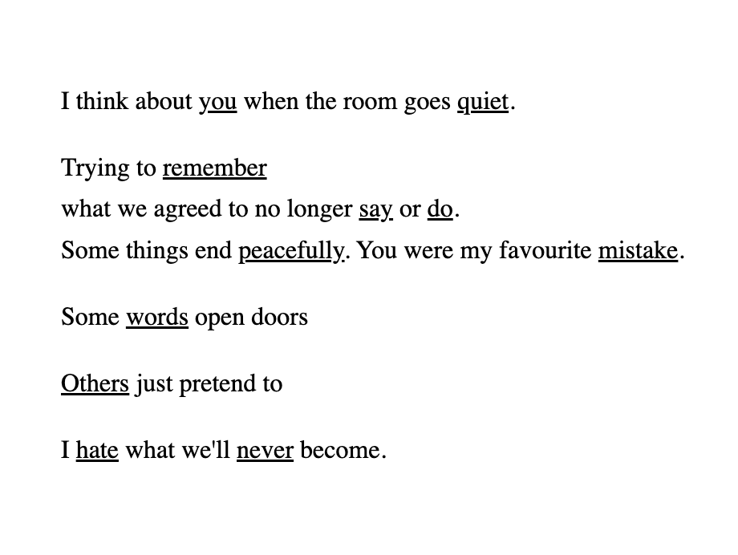
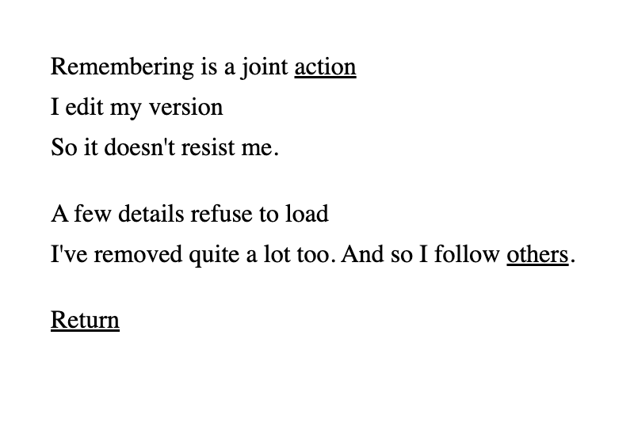
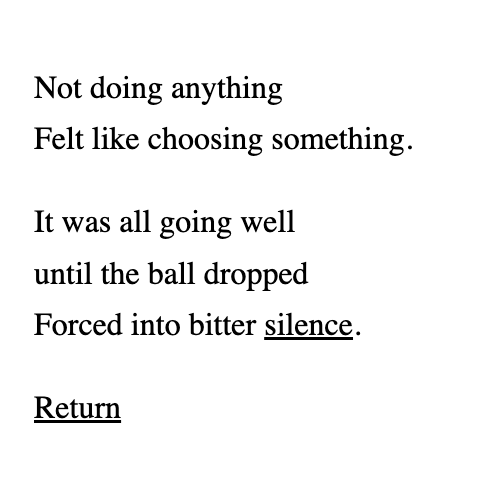

# Week 2

Anatomy of a WebPage Part 2: Using Hyperlinks Creatively.

## Requirements

Written in HTML and CSS.

No special libraries required.

## Operation
Run `poem.html` in your selected browser.

## Screengrab

## Design Notes
- Designed the poem to be read in any order
- Kept the visual design minimal to prioritse the poem itself
- Future improvement: accessibility wise, add font size option

