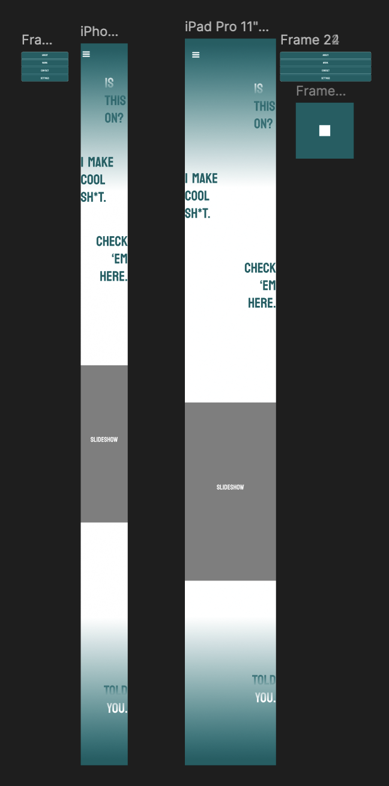

# Week 4

CSS Layouts and Responsive Design: Designing the Main Page of the portfolio Website Using Figma

## Requirements

Designed in Figma

No special libraries required.

## Operation
Open link in browser: https://www.figma.com/design/EXD8wI57JNsPkyL53NMQEy/fm-style-portfolio?node-id=0-1&p=f&t=m6w5hHChJn4WtGNU-0

## Screengrab

## Design Notes
- Initial designs for the website
- Football Manager Main Screen was initial inspiration, changed idea later on for simplicity