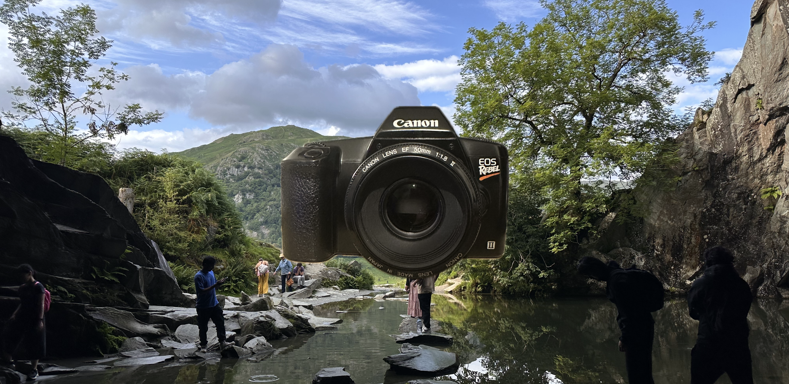

# Week 9

Animation with GSAP: Life of a Personal Object

## Requirements

Written in HTML, JavaScript (with GSAP plugin) and CSS.

No special libraries required.

## Operation
Run `LoPO.html` in your selected browser.

## Screengrab

## Design Notes
- Used my own camera and photos i'd taken on it
- Future Improvement: i wanted the camera to look more scratched the more you clicked but couldn't get it working well enough

